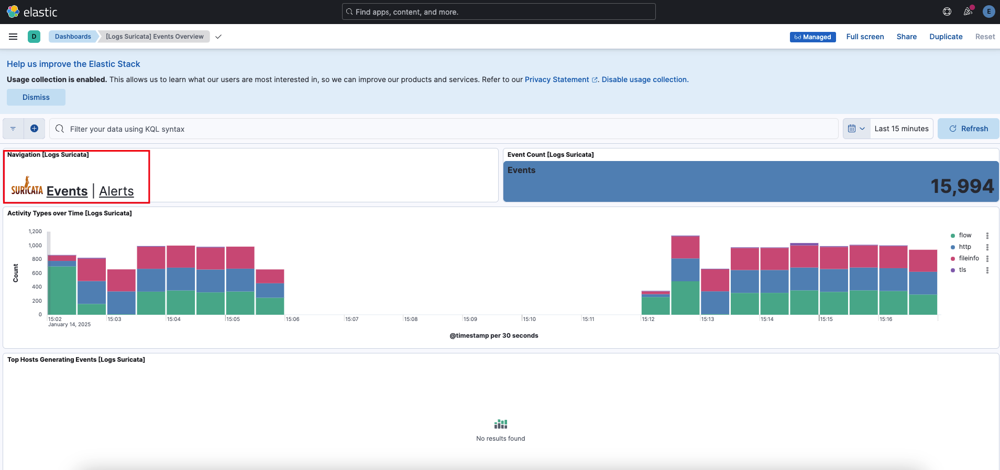

# ELK-Suricata


[ALIXAR BLUE TEAM](https://alixarblue.team)


[CIBERIA SOTERO](https://ciberiasotero.iessoterohernandez.es)

SIEM Elastic Logstash y Kibana (ELK) integrado con el IDS SURICATA para el taller de Incidentes: monitorización de alertas, registro de incidentes de las III Jornadas CIBERIA SOTERO, realizado por el equipo de Ciberseguridad del IES ALIXAR (ALIXAR BLUE TEAM) de Castilleja de la Cuesta (Sevilla)


## Índice

1. [Introducción](#introducción)
2. [SOC Open Source](#soc-open-source)
3. [Infraestructura ELK](#infraestructura-elk)
4. [Configuración](#configuración)
5. [Configuración de Fleet y Elastic Agent](#configuración-de-fleet-y-elastic-agent)
6. [Integraciones con Docker y Suricata](#integraciones-con-docker-y-suricata)
7. [Configuración de SURICATA](#configuración-de-suricata)
8. [Casos de Prueba con DVWA](#casos-de-prueba-con-dvwa)
   - [CP01 SQL Injection UNION](#cp01-sql-injection-union)
   - [CP02 Reflected Cross Site Scripting (XSS)](#cp02-reflected-cross-site-scripting-xss)
   - [CP03 File Inclusion](#cp03-file-inclusion)
   - [CP04 Fuerza Bruta](#cp04-fuerza-bruta)
   - [CP05 Reverse Shell](#cp05-reverse-shell)

## Introducción

Un **SOC (Security Operations Center)** es un centro especializado donde un equipo de profesionales monitorea, detecta, analiza y responde a amenazas de ciberseguridad en tiempo real para proteger la infraestructura de TI de una organización. Este equipo incluye analistas de seguridad, ingenieros de seguridad, especialistas en amenazas (threat hunters), y gestores de incidentes. Utilizan herramientas avanzadas y sistemas de análisis de tráfico para garantizar la ciberseguridad de una organización.

Algunas de las herramientas que utilizan son:

**SIEM (Security Information and Event Management)** cuyo propósito es monitorear sistemas o entornos para detectar actividades sospechosas e identificar amenazas en tiempo real que permitan a un equipo de ciberseguridad reaccionar rápidamente ante cualquier amenaza. Algunas herramientas de este tipo son Elastic Security, Splunk, y IBM QRadar.

**IDS (Intrusion Detection System)** que son sistemas que monitorean el tráfico de red o actividad en sistemas en busca de comportamientos sospechosos o patrones maliciosos, alertando al personal de ciberseguridad. Ejemplos Suricata, Zeek (IDS),...

**IPS (Intrusion Prevention System)** que a diferencia del IDS, no solo detecta esas actividades, sino que también actúa automáticamente para bloquearlas o prevenir su ejecución. Ejemplos Snort (IDS/IPS), Zeek (IDS), Suricata+Pfsense,...

**SOAR (Security Orchestration, Automation, and Response)** que son plataformas que integran y automatizan procesos de detección, análisis y respuesta a incidentes de seguridad, combinando la orquestación de herramientas de seguridad, la automatización de tareas repetitivas y flujos de trabajo, y la gestión de casos para ayudar a los equipos de seguridad a responder de manera más rápida y eficiente. Ejemplos de SOAR incluyen The Hive, Splunk Phantom, Palo Alto Cortex XSOAR, y IBM Resilient.

## SOC Open Source

Este proyecto combina herramientas de open source como el stack ELK (Elastic, Logstash, Kibana) con el sistema de detección de intrusiones Suricata, así se consigue proporcionar una plataforma para la monitorización en tiempo real, la gestión de incidentes y el análisis de seguridad de aplicaciones y de entornos.

La siguiente imagen muestra el esquema completo de un SOC completamente diseñado con herramientas open source.


En nuestro caso faltaría agregar la parte de gestión de los incidentes que se registran (The Hive, Cortex y MISP).

## Infraestructura ELK

El stack ELK es un conjunto de productos desarrollados por Elastic. Elasticsearch, Logstash y Kibana, complementados con los Beats. 
Sus objetivos son recibir datos desde diversas fuentes y formatos y transformar, buscar, analizar y visualizar estos datos gráficamente en un dashboard.

El flujo típico incluye:

* Generador de logs.
* Recolector de datos (Beats).
* Procesador de datos (Logstash).
* Almacén de datos (Elasticsearch).
* Visualizador (Kibana).


¿Qué infraestructura estamos montando para monitorear sistemas y entornos?

**Elastic Agent**
Elastic Agent es una herramienta unificada de recopilación de datos y en Elastic Stack. Puede recopilar logs, métricas, datos de seguridad.

**Fleet Server**
Fleet Server es un componente central que gestiona los agentes Elastic (Elastic Agents). Actúa como intermediario entre los agentes y Kibana, permitiendo registrar, coordinar, y aplicar políticas de configuración a los agentes. Esto facilita la gestión de los agentes al tenerlos todos centralizados y controlados por FLEET.


---

## Configuración

A continuación los pasos para configurar el entorno.

### Pasos para configurar el entorno:

1. **Clonar el repositorio**:

   ```bash
   git clone https://github.com/antonio-gabriel-gonzalez-casado/elk-suricata.git
   cd elk-suricata
   ```

2. **Copiar el fichero de ejemplo `.env.dist`** y renombrarlo a `.env`:

    ```bash
    cp env.dist .env
   ```

3. **Modificar los valores por defecto** en el archivo `.env`, especialmente aquellos marcados como `changeit`:

   ```env
    # Password for the 'elastic' user (at least 6 characters)
    ELASTIC_PASSWORD=changeit

    # Password for the 'kibana_system' user (at least 6 characters)
    KIBANA_PASSWORD=changeit

    # Version of Elastic products
    STACK_VERSION=8.15.3

    # Set the cluster name
    CLUSTER_NAME=docker-cluster

    # Set to 'basic' or 'trial' to automatically start the 30-day trial
    LICENSE=basic

    # Port to expose Elasticsearch HTTP API to the host
    ES_PORT=9200

    # Port to expose Kibana to the host
    KIBANA_PORT=5601

    # Increase or decrease based on the available host memory (in bytes)
    MEM_LIMIT=2g

    # Project namespace (defaults to the current folder name if not set)
    #COMPOSE_PROJECT_NAME=myproject

    # Clave de encriptación de los datos (al menos 32 carácteres y que sea segura)
    # Utilizar esta utilidad https://passwords-generator.org/32-character
    # Escribir la clave genenrada entre ""
    ENCRYPTEDSAVEDOBJECTS_ENCRYPTIONKEY=changeit

    # Clave de encriptación de los datos (al menos 32 carácteres y que sea segura)
    # Utilizar esta utilidad https://passwords-generator.org/32-character
    # Escribir la clave genenrada entre ""
    SECURITY_ENCRYPTIONKEY=changeit

    # Clave de encriptación de los datos (al menos 32 carácteres y que sea segura)
    # Utilizar esta utilidad https://passwords-generator.org/32-character
    # Escribir la clave genenrada entre ""
    REPORTING_ENCRYPTIONKEY=changeit

    # Elastic Agent configuration
    FLEET_ENROLLMENT_TOKEN=<fleet-enrollement-token>

    # Port to expose FLEET_SERVER to the host
    FLEET_SERVER_PORT=8220
   ```

4. **Arrancar los servicios con Docker Compose**:
   ```bash
   docker compose up -d
   ```

5. **Verificar el estado de los contenedores**:
   ```bash
   docker ps
   ```
Estarán arrancados todos los contenedores, excepto el  elk-suricata-dvwa-agent-1 que estará reiniciándose porque no hemos establecido un token válido.


---

## Configuración de Fleet y Elastic Agent

Entramos en Kibana: https://localhost:5601/

Aceptamos el certificado invalido


Hacemos login con el usuario elastic y la contraseña establecida en el .env para este usuario


Accedemos a la sección del menú lateral izquierdo: Management --> Fleet


Vemos que el servidor fleet está healthy


Añadiremos ahora un nuevo Agente


Pulsamos el botón Create Policy


En el paso 2, elegimos la opción Enroll in Fleet ya que este disponemos de este controlador de agentes


En el paso 3, vamos a copiar el token que es necesario para nuestro agente y que lo tenemos que establecer en nuestro .env


El token copiado lo establecemos entre "" en la variable de entorno FLEET_ENROLLMENT_TOKEN


Una vez hecho esto reconstruimos y arrancamos los contenedores de nuevo para estabilizar el contenedor del agente que se estaba reiniciando

   ```bash
   docker compose up --build -d 
   ```

Si el contenedor del agente no se arranca solo entonces lo hacemos de forma manual:

   ```bash
   docker start elk-suricata-dvwa-agent-1
   ```

Una vez arrancado al acceder a la pantalla donde estábamos creando el agente vamos a ver que se ha integrado automáticamente


---
## Integraciones con Docker y Suricata

Como estamos en una infraestructura Docker se necesita añadir una integración que permitirá a los agentes recuperar datos y métricas de los distintos contenedores. Esto lo haremos en el menú de la Izquierda --> Management --> Integrations


Buscamos Docker 


Pulsamos el botón Add Docker


En esta pantalla de configuración dejamos los valores por defecto excepto en el punto 2 donde tendremos que elegir la política que ya disponemos


Acto seguido añadimos de igual forma la integración de SURICATA


El paso importante es el de poner elegir la política de agente ya creada, todo lo demás se queda por defecto.


Después de unos minutos de espera mientras se configura la integración, podemos acceder al menú de la izquierda --> Management --> Fleet --> Host del Agente


Y habrá un estado representado por unos circulos verdes que estarán en verde


---

## Configuración de SURICATA

La configuración de SURICATA de este proyecto es la que está preparada para realizar los casos de prueba que haremos más adelante.

La única comprobación que debemos hacer es la siguiente.

Obtenemos la interfaz de red que tienen los contenedores. Esto se hace entrando lanzando el siguiente comando para listar las interfaces web asociadas al contenedor suricata:

   ```bash
   docker exec elk-suricata-dvwa-1 ip -o link show
   ```
Normalmente la interfaz de red suele ser la que está detrás de la ```lo:``` (que es la interna) pero en este caso se muestra un listado y la más típica suelen ser ```eth0:```


La configuración actual está preparada para trabajar con ```eth0:``` pero si en tu caso fuera otra la interfaz de red tendrías que reemplazar ```eth0``` por la ```tuya``` en los ficheros:

* [DVWA/suricata/config/suricata.yaml](DVWA/suricata/config/suricata.yaml)
* [DVWA/suricata/entrypoint.sh](DVWA/suricata/entrypoint.sh)

### Reglas en SURICATA

En el fichero:

* [DVWA/suricata/rules/custom.rules](DVWA/suricata/rules/custom.rules)

Están reglas personalizadas de detección para ataques comunes a aplicaciones web, organizadas en categorías como inyección SQL, inyección de comandos, intentos de fuerza bruta, acceso a archivos sensibles, traversal de directorios, intentos de reverse shell y ataques Cross-Site Scripting (XSS). Estas reglas analizan principalmente el contenido de solicitudes HTTP, incluidas las URI y los datos del cuerpo, para identificar patrones específicos asociados con actividades maliciosas, como palabras clave (SELECT, UNION, ../), uso de comandos peligrosos (cat /etc/passwd, bash -i >& /dev/tcp/), o comportamientos sospechosos (envío masivo de paquetes o detección de scripts maliciosos en etiquetas HTML). Las reglas también incluyen configuraciones avanzadas, como umbrales de tráfico, para detectar ataques como DDoS o fuerza bruta.

### Dashboads de Eventos y Alertas de Suricata

Para poder visualizar los eventos y alertas detectados por SURICATA hay que acceder a KIBANA y usar su buscador para encontra los dashboards.


Elegimos cualquiera de los dos, ya que desde dentro de los mismos, se puede navegar entre uno y otro.

Este sería el Dashboard de Eventos



Y este sería el Dashboar de Alertas, que a priori no debe tener ninguna.


---
## Casos de Prueba con DVWA

Utilizaremos DVWA (Damn Vulnerable Web Application) que es una aplicación web intencionalmente vulnerable diseñada para aprender y practicar técnicas de seguridad web en un entorno controlado. Es ampliamente utilizada por profesionales de ciberseguridad y otras personas para aprender sobre vulnerabilidades comunes y entender las amenazas en aplicaciones web.

La url de acceso a la aplicación DVWA es http://localhost:4280 con el usuario ```admin``` y la contraseña ```password```

### CP01 SQL Injection UNION

Detecta inyecciones SQL que usan la palabra clave UNION.

Lanzamos el siguiente enlace: http://localhost:4280/vulnerabilities/sqli/?id=UNION&Submit=Submit#

Resultado en KIBANA


### CP02 Reflected Cross Site Scripting (XSS)

Detecta intentos de inyección XSS con la etiqueta ```<script>```. Ejemplo: ```<script>alert(1)</script>```

Lanzamos la siguiente url: http://localhost:4280/vulnerabilities/xss_r/?name=%3Cscript%3Ealert%281%29%3C%2Fscript%3E#

Resultado en KIBANA


### CP03 File Inclusion

Detecta intentos de acceso a directorios no autorizados. Ejemplo: page=../../etc/passwd

Lanzamos la siguiente url: http://localhost:4280/vulnerabilities/fi/?page=../../etc/passwd

Resultado en KIBANA


### CP04 Fuerza Bruta

Si se hace intento de login más de 10 veces en 10 segundos. 

Puedes usar este script que genera más de 10 intentos fallidos de acceso a la funcionalidad de fuerza bruta de la aplicación DVWA:

[scripts/simulate_brute_force.sh](scripts/simulate_brute_force.sh)

Lanzándolo con este comando:

```bash
sh scripts/simulate_brute_force.sh
```

Resultado en KIBANA:


### CP08 Reverse Shell

Un reverse shell es una técnica para obtener acceso remoto a un sistema objetivo. Es una conexión de shell inversa donde el sistema comprometido inicia la conexión hacia el atacante, en lugar de que el atacante se conecte directamente al sistema objetivo.

Puedes usar este script genera un payload malicioso contra funcionalidad de command injection de DVWA:

[scripts/test_shell_reverse.sh](scripts/test_shell_reverse.sh)

```bash
sh scripts/test_shell_reverse.sh
```

Resultado en KIBANA:

